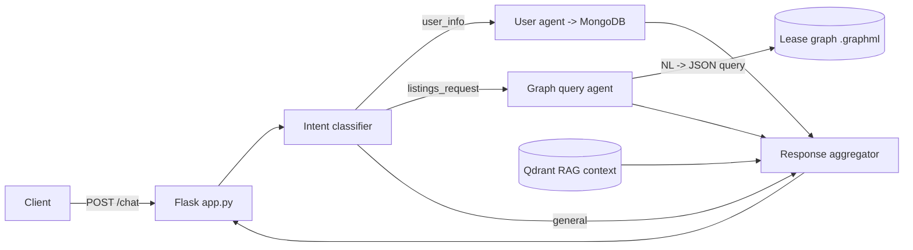

# LeaseLens

A multi-agent conversational assistant for commercial real estate leasing, combining an LLM, a lease knowledge graph and vector search behind a Flask API.

## Overview

Brokers and clients ask questions about office leases in plain language ("Who handled the lease with the highest rent?", "What properties are on Broadway?"). LeaseLens classifies each message, routes it to specialised agents (user-profile extraction, lease/property lookup, general conversation) and merges their outputs into one answer. Lease data is modelled as a NetworkX knowledge graph of leases, properties and brokers, which Google Gemini queries through a structured query translator; users, chat history and sessions live in MongoDB and are mirrored into Qdrant for semantic retrieval.

## Key features

- **Intent-routed multi-agent pipeline** (`agents.py`): intent classifier, user-info agent, listing/graph agent and a response aggregator.
- **Lease knowledge graph** (`init/create_graph.py`, `Agents/graph_query_agent.py`): Lease, Property and Broker nodes with `LOCATED_AT` / `HANDLED_BY` edges; Gemini translates questions into one of a fixed set of graph queries (averages, top-N, rent ranges, GCI thresholds, broker lookups, keyword search).
- **Fuzzy matching fallback** for keyword search over graph nodes (`fuzzywuzzy`).
- **RAG over CRM data** (`vector_db_setup.py`): users, chat history, listings and sessions embedded with `all-MiniLM-L6-v2` (384-dim) into Qdrant.
- **CRM endpoints**: create, read, update and delete users; per-user conversation history grouped by session.
- **Session tagging**: each session is tagged `Unresolved`, `Inquiring` or `Resolved`.
- **Document ingestion**: upload listings as CSV, JSON, TXT or PDF (`/upload_docs`).

## Tech stack

Python, Flask, Google Gemini (`google-genai`, `google-generativeai`), NetworkX, MongoDB (`pymongo`), Qdrant, sentence-transformers, Pydantic, pandas, pdfplumber, NLTK, fuzzywuzzy.

## How it works



More detail: [ARCHITECTURE.md](ARCHITECTURE.md) (components and data flow) and [API_CONTRACT.md](API_CONTRACT.md) (every endpoint with request/response examples).

## Repository structure

```
app.py                     Flask API (chat, ingestion, CRM, admin routes)
agents.py                  Intent classification and agent orchestration
Agents/
  genai_wrapper.py         Gemini facade over the graph query agent
  graph_query_agent.py     NL -> structured query -> NetworkX execution
  prompts.py               System prompts
init/create_graph.py       Builds the lease graph from CSVs in ./data
data/                      Sample knowledge base CSV and generated graph files
models.py                  Pydantic models (UserRecord, ChatRecord, CRERecord)
user_data.py               MongoDB user and chat management
vector_db_setup.py         Qdrant collections and MongoDB -> Qdrant sync
setup.py                   Optional helper that checks prerequisites
test_chat_endpoint.py      Sends a sample request to a running server
test_script_graphs.py      Queries the graph agent directly
```

## Getting started

Prerequisites: Python 3.10+, Docker (for Qdrant), a MongoDB instance and a Gemini API key.

```bash
git clone https://github.com/DJCodesStuff/LeaseLens.git
cd LeaseLens
python -m venv venv && source venv/bin/activate
pip install -r requirements.txt

cp env.example .env        # then fill in MONGO_URI and GEMINI_API_KEY
echo "MODEL_NAME=gemini-2.5-flash" >> .env   # required by the graph agent

docker run -p 6333:6333 qdrant/qdrant       # vector database
python init/create_graph.py                 # rebuild data/lease_graph.* (optional, prebuilt files are included)
python vector_db_setup.py                   # create Qdrant collections and sync
python app.py                               # serves on http://localhost:5000
```

Try it:

```bash
curl -X POST http://localhost:5000/chat \
  -H "Content-Type: application/json" \
  -d '{"message": "What are the properties on Broadway?", "user_id": "user1@example.com"}'
```

or run `python test_chat_endpoint.py` against the running server.

## API at a glance

| Method | Endpoint | Purpose |
|---|---|---|
| POST | `/chat` | Send a message, get an agent response |
| POST | `/upload_docs` (alias `/upload_listings`) | Ingest listings from CSV/JSON/TXT/PDF |
| POST | `/users` (alias `/crm/create_user`) | Create a user |
| GET / PUT / DELETE | `/crm/get_user/<id>`, `/crm/update_user/<id>`, `/crm/delete_user/<id>` | Manage a user |
| GET | `/crm/conversations/<user_id>` | Conversation history grouped by session |
| POST | `/crm/resolve_session/<session_id>` | Mark a session `Resolved` |
| POST | `/reset` | Clear chat history (all or one user) |
| POST | `/admin/sync-vector-db` | Re-sync MongoDB into Qdrant |

## Author

**Dhruv Joshi** - [GitHub](https://github.com/DJCodesStuff) - [Portfolio](https://djcodesstuff.github.io/)
